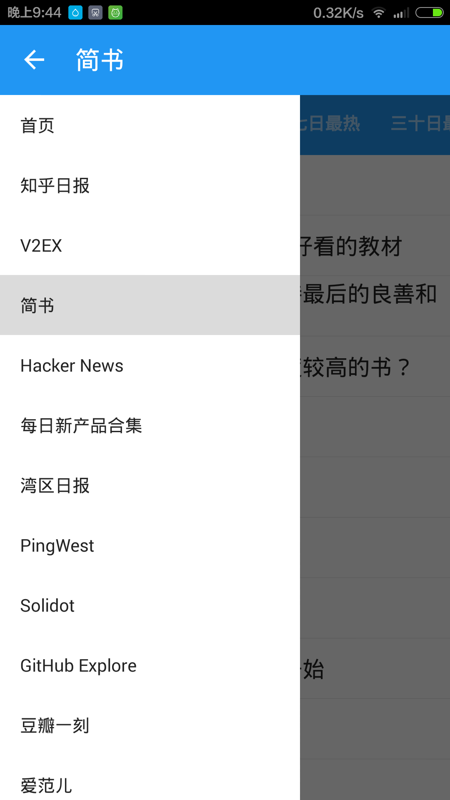

# zlist-android
Android Client for ZList.

## Alpha 版

[Apk 文件下载地址](doc/demo/zlist.apk)

## Build in Docker

    git clone git@github.com:zlisthq/zlist-android.git <someDir>
    cd someDir
    docker build -t zlist-android .
    docker run -v <someDir>:/android  zlist-android

## Screenshots

首页

条目

菜单

## TODO
- 添加 Logo
- 离线下载
- 夜间模式
- 订阅功能
- 设置功能
- 统计功能
- 反馈功能
- 发布
